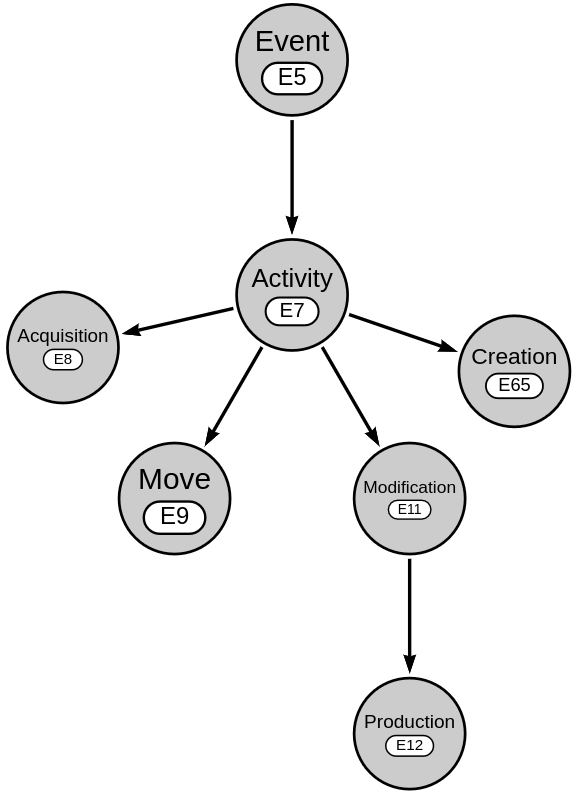

Event
=====

.. toctree::

CIDOC documentation:
:cidoc_entity:`E7 Activity<e7-activity>`,
:cidoc_entity:`E8 Acquisition<e8-acquisition>`,
:cidoc_entity:`E5 Event<e5-event>`,
:cidoc_entity:`E11 Modification<e11-modification>`,
:cidoc_entity:`E9 Move<e9-move>`,
:cidoc_entity:`E12 Production<e12-production>` and
:cidoc_entity:`E65 Creation<e65-creation>`

* **Activity** (:cidoc_entity:`E7 Activity<e7-activity>`) - The most common
  form of event, such as a battle, a meeting, or a wedding
* **Acquisition** (:cidoc_entity:`E8 Acquisition<e8-acquisition>`) - Maps a
  change of property from one owner to another
* **Creation** (:cidoc_entity:`E65 Creation<e65-creation>`) - The creation
  of a document (file; for the making of an artifact use production)
* **Event** (:cidoc_entity:`E5 Event<e11-modification>`) - Used for events
  **without human involvement** such a natural disaster
* **Modification** (:cidoc_entity:`E11 Event<e5-event>`) - Used to track
  the modification of artifacts, e.g. a conservation treatment or a change
  of parts
* **Move** (:cidoc_entity:`E9 Move<e9-move>`) - Movement of artifacts or
  a person
* **Production** (:cidoc_entity:`E12 Production<e12-production>`) - The
  creation of artifacts

`CIDOC CRM <https://www.cidoc-crm.org/>`_ hierarchy for the different types of
events included in OpenAtlas.

.. include:: navigation.rst

Form fields
-----------
* :doc:`/ui/name`
* :doc:`type`
* :doc:`/ui/date`
* :doc:`/ui/description`
* **Location** - The :doc:`place` where an event happened
* **Sub event of** - As Events can be part of another event (e.g. a battle as
  a sub event of a war), they can be linked here
* **Preceding event** - Events can follow up other events, useful for e.g.
  entering a journey, link them here
* :doc:`reference_system`

Can be linked via tabs to
-------------------------
* :doc:`source` - Use this way to link to a source if an event is refered to
  in it
* :doc:`actor` - Add participants or recipient and donor in case of an
  acquisition
* :doc:`reference` - Add a citation
* :doc:`file` - Add a file such as an image

For a step by step instructions have a look at our :doc:`/examples/index`.

Acquisition
***********
* **Given place** - Select which :doc:`places <place>` changed ownership
* **Given artifact** - Select which :doc:`artifacts <artifact>`
  changed ownership

To add **recipients** and **donors** use to the **Actor** tab, add actors and
select as activity:

* **acquired title through** for **recipients**
* **surrendered title through** for **donors**

Creation
********
* Document (:doc:`file`) - Select files that were created

The creators of the document can be added via the **Actor** tab; therefore,
select **carried out by** to link

Modification
************
* :doc:`artifact` - Select artifact(s) that were modified

The creators of an artifact can be added via the **Actor** tab; therefore,
select **carried out by** to link

Move
****

* **From** - :doc:`place` - as a starting point
* **To** - :doc:`place` - as a destination point
* Moved :doc:`artifact` - Select the artifact(s) moved in an event
* Moved :doc:`Person <actor>` - Select the people moved in an event

Unfortunately CIDOC CRM doesn't allow for a **moved by** relation for groups.
It is still possible to "move" groups via the actor tab, which in the
background creates a more general **participated at** relation between the
group and the move event. For more information please take a look at
:doc:`/examples/journey` or :doc:`/examples/move_event` tutorial.

Production
**********
* :doc:`artifact` - Select artifact(s) that was/were produced during the
  production event

The creators of an artifact can be added via the **Actor** tab. Therefore,
select **carried out by** to link
