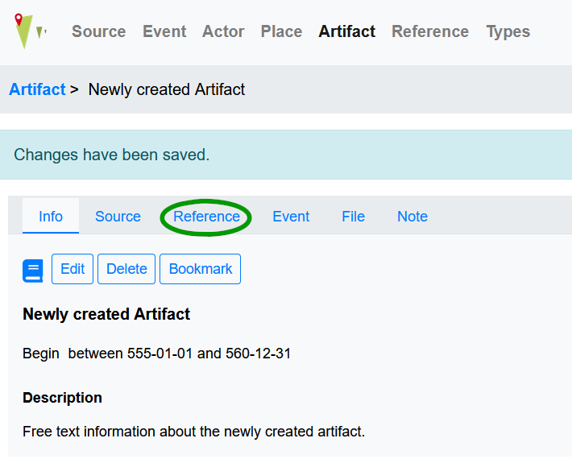
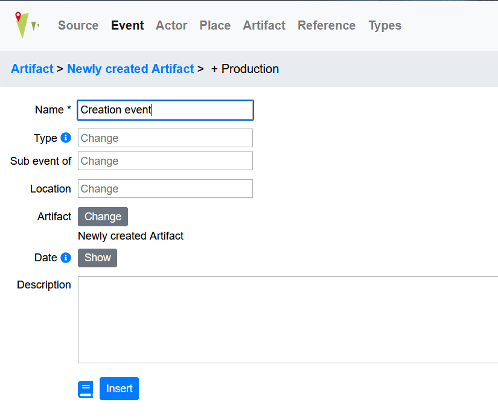

Artifacts
=========

.. toctree::

This tutorial describes how to create a new artifact and add information to it.
The following elements are involved:

* :doc:`/entity/artifact`: A physical object, made by humans – e.g. a coin,
  a letter, or a tool
* :doc:`/entity/actor`: As creator and/or owner of the artifact
* :doc:`/entity/event`: Creation of the artifact
* :doc:`/entity/file`: You can upload an image file connected to the artifact
* :doc:`/entity/reference`: Link a reference to the artifact

Add a new artifact
------------------
To create an artifact as representation of the object you want to add:

* Click on :doc:`/entity/artifact` in the :doc:`/ui/menu` and create a new
  entry by using the **+ Artifact** button
* Choose a descriptive **name**
* Select an appropriate :doc:`/entity/type` from the list
* **Owned by**: If applicable, choose an owner of the artifact, e.g. a museum
  it is stored at or a person who possesses the artifact
* Add further information such as **date** or **description** or choose options
  from type trees
* Press **Insert** to save the entry

Regarding date: the begin date represents the creation of the artifact and can
be entered as a time span.
Regarding the description field: this can be used to record information
that is not covered by the various types. Keep in mind, using types
has advantages over free text in the description field (Especially for the
presentation of an artifact on the presentation site).
If there is no fitting type, please follow this
:doc:`instruction</examples/types>` to add new types to the list. Please
note, that “owned by” is not used to link a creator of an artifact. You can
link a creator by adding a creation event (see below).

Add a reference to the artifact
-------------------------------
To link a reference to a newly created artifact, choose
:doc:`/entity/reference` from the tabs

Then choose from the following options:

* Link the artifact to an already existing reference by using the **Link**
  button
* Create a new :doc:`/entity/reference` by using the **+ Bibliography** or
  **+ Edition** button
* Create a new :doc:`external reference</entity/reference>` by using the
  **+ External reference** button

Add a file to the artifact
--------------------------
To add an image file (or any other sort of file, really) to the artifact,
choose **File** from the tabs. Then choose from the following options:

* Link the artifact to an already uploaded file
* Upload a new file by using the **+ File** button, you can add information and
  choose a file here

Link a creation event
---------------------
To do so, click the **Event** tab. Here click the **+ Production button**.

* Choose a descriptive **name** for the creation event
* Select an appropriate :doc:`/entity/type` from the list
* Add other information as needed such as a date or add free text in the
  description field
* Press **Insert** to save the entry

Add a creator to the creation event
-----------------------------------
If the creator of an artifact is known, you can add the person after saving the
creation event by clicking **Event** in the artifact’s view. On the event’s
landing page, click the **Actor** tab to link a creator (or other kind of actor
involved).

Here you can:

* Link the creation event to an already existing :doc:`/entity/actor`
* Create a new person as actor connected to the :doc:`/entity/event`
* Create a new group as actor connected to the event

Please use **Link** here to be able to choose an actor as creator (or add a new
actor, go back to the event page, choose actor - link again and follow the steps
below). You can now add the following information:

* Type of actor, in this case choose creator
* Actor: choose the creator of the artifact from a list of already added actors
* Change activity “**from participated**” in to “**performed**”
* if known, add a date for the creation of an artifact and/or add a description

With the above steps you have created an artifact connected to a creation event
and actor as creator.

Add multiple locations to an artifact
-------------------------------------
First of all, adding an artifact to more than one :doc:`/entity/place` or
:doc:`/entity/feature` is not possible. If an artifact has a link to multiple
locations, it is possible to keep track of that in the following way:

* Choose the :doc:`/entity/place` the artifact has it's first occurrence at,
  for example its production site or a place an artifact was found at during
  archaeological excavation.
* link any other place by adding a move event - for example when an artifact
  is moved from an excavation site to a museum or from a production site to
  a buyer's house. Click here to see a short tutorial
  on adding a :doc:`move_event`

**Example:** Leonardo painted the Mona Lisa in his workshop in Florence,
therefore Florence would be linked to the artifact as place. It was then
acquired by King Francis of France and exhibited in Château d'Amboise. This
change of location can also be tracked in the database by a :doc:`move_event`.
Another :doc:`move_event` maps the transfer of the image to Fountainebleau.
By adding further move events the way of the artwork to its present
location -the Louvre in Paris - can be documented.

To learn more on how to use a move event, please see the tutorial on
:doc:`/examples/letters`).
