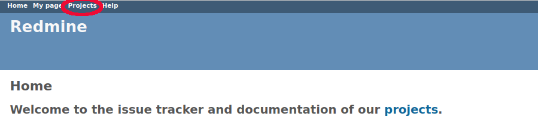
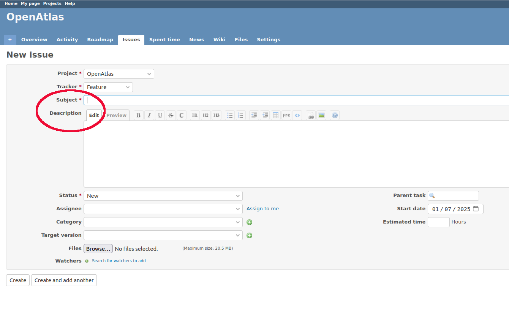

How to report an issue
======================

.. toctree::

This short tutorial describes the best way to report an issue.
OpenAtlas uses `Redmine <https://www.redmine.org/>`_ as an issue
tracker. It is a flexible project management web application that is open
source and released under the terms of the
`GNU General Public License v2 <https://www.gnu.org/licenses/old-licenses/gpl-2.0.html>`_.

In addition to being used as
`OpenAtlas issue tracker <https://redmine.openatlas.eu/projects/uni>`_, the
application is used to publish
`public meeting minutes <https://redmine.openatlas.eu/>`_, for
`technical documentation <https://redmine.openatlas.eu/projects/uni/wiki>`_ and
to plan and document the project's own
`roadmap <https://redmine.openatlas.eu/projects/uni/roadmap>`_.

Where to report - Redmine
-------------------------

While using OpenAtlas, problems (bugs) can occur from time to time. This is
due to the active and dynamic further development of the database system. If
problems occur when using the application, it would be great if these
get reported. This is the only way we as a team can ensure that bugs
caused by the database itself can be rectified quickly and that data input
works smoothly again.

The easiest way to report such a problem is via
`OpenAtlas Redmine <https://redmine.openatlas.eu/projects/uni>`_.

Besides reporting bugs in that way you can also request a new feature or ask a
question.

How to report an issue
----------------------

Get a redmine account
*********************
To report an issue, an account must first be created. This is - of course -
completely free of charge and all you need is a valid email address and a
password.
Activation is not automatic, but is carried out manually by the OpenAtlas team.
This may take some time. Therefore, it might be best to create an account
before it is needed to report bugs.

Create a new issue
******************
Once you are logged in, click the **Projects** link in the top left.

Then click on OpenAtlas or OpenAtlas Discovery (depending on where the issue
occurred). This will bring you to the overview page. On the top left you can
find a **+ Button**. Hover over it with the mouse and select
**New issue** which brings you to an empty form.

Fill out the form
*****************
**Don't be alarmed**, reporting bugs in Redmine is easy and uncomplicated even
if the form asks for many details - we only ask you to fill in few
information. Everything else will be taken care of by the OpenAtlas team.

There are only two important form fields:

* **Subject** - please give a descriptive name for the issue you are reporting
  (similar to e.g. the subject of an email)
* **Description** - please describe the issue you want to import. What happened
  and where in the OpenAtlas instance did it happen. If possible, we kindly
  ask you to provide a **link** to where you found the problem. This makes it
  easier for us to find and resolve the issue for you.

All other fields are optional for you to fill out. But keep in mind that a
screenshot of the issue (can be added at the end of the form via the Browse
button) can facilitate our work. Other optional form fields:

* Project - provides a list of projects. You can pick from the drop down
  list in which project the issue happened
* Tracker - there are four different types of issues you can report:

  * Bug: Report an error
  * Features: Request a new feature such as a new function
  * Question: Use to ask a question
  * Administration: Use for administrative tasks such as server upgrades or
     planning an event

* Status - please leave status on new if it is not yours to work on

  * New: A new issue
  * Acknowledged: The issue has been recognized and accepted
  * Assigned: Someone was assigned to work on it
  * In progress: Someone is actively working on the issue
  * Resolved: The issue has been dealt with but is not fully resolved yet -
     some more testing, etc. might be needed
  * Closed: The issue has been resolved
  * Rejected: The issue was rejected and an explanation was given
  * Duplicate: The issue was already reported

* Priority - not in use within the OpenAtlas Redmine. The priority of issues
  is determined through their placement in the roadmap
* Assignee - please only choose yourself as assignee or leave it blank
* Target version - please leave blank. It is only needed for internal
  project planning
* Found in version: Only available for bugs, you can fill in the version
  number of your instance (can be found in the upper right corner of your
  OpenAtlas instance page)

Afterwards you can press **Create** to save and send the issue to us or press
**Create and add another** to save the issue and start a new issue form
immediately.
Planned future releases with corresponding issues can be viewed on the
`OpenAtlas roadmap <https://redmine.openatlas.eu/projects/uni/roadmap>`_.
Please note that the development of OpenAtlas is a fluid process and
planned releases of new features might change.

