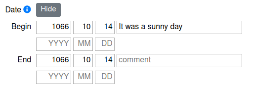
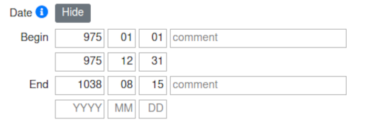
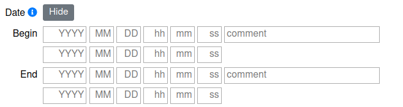

Time Spans
==========

.. toctree::

This section is focused on how the :doc:`Date</ui/date>` input fields work
and how to put in time spans correctly.

Where to find the input fields
------------------------------

:doc:`Date</ui/date>` input fields can be found on the following:

* All forms connected to :doc:`Events</entity/event>`
* All forms connected to :doc:`Actors</entity/actor>`
* All forms connected to :doc:`Types</entity/type>`
* :doc:`Places</entity/place>`
* :doc:`Features</entity/feature>`
* :doc:`Statigraphic Units</entity/stratigraphic_unit>`
* :doc:`Artifacts</entity/artifact>`

It is not provided for the input of:

* :doc:`Sources</entity/source>`
* :doc:`References</entity/reference>`

The **Date** field itself can be found at the bottom of the form, its input
field is initially hidden. It can be used by clicking the **Show** button.

How to enter dates and time spans
---------------------------------

.. image:: date.png

The form consists of two parts:

* **Begin**
* **End**

Begin and end each provide two lines for data entry. This can be used for
entering precise, known data as well as for tracking time spans.

The following values can be put in:
* Year (YYYY) as four digits: -4713 to 9999, the year 0 is not allowed
* Month (MM) as two digits: 1 to 12
* Day (DD) as two digits: 1 to 31
* Hour (hh) as two digits: 0 to 23
* Minute (mm) as two digits: 0 to 59
* Seconds (ss) as two digits: 0 to 59
* Comments as free text for additional information

Years before the year 0 can be indicated by a preceding minus. Please note that
years before the year 4713 BC (spelling -4713) cannot be entered at the moment
due to software restrictions by PostgreSQL.
Furthermore, as PostgreSQL uses the
`Proleptic Gregorian calendar <https://en.wikipedia.org/wiki/Proleptic_Gregorian_calendar>`_,
the year 0 can not be entered either.

Precise dates
^^^^^^^^^^^^^

If precise dates are known, enter the beginning into the first line of
**Begin** and the end date into the first line of **End**. You can add comments
in the comment field.
Think of a historic battle with known dates, e.g. the Battle of Hastings which
was fought between William Duke of Normandy with his Norman-French troops and
King Harold Godwinson and his English army on the 14th of October 1066.
To track this dates, fill in 1066 as year, 10 as month and 14 as day for
**Begin** and **End** alike.

Or think of the Peace of Westphalia as collective name for two peace treaties,
signed in 1648 in Osnabrück (15th of May 1648) and Münster (24th of October
1648). The treaties ended the Thirty Years' War as well as the Eighty Years'
War. To track those dates add 1648 - 05 - 15 into the first row of **Begin**
and 1648 - 10 - 24 into the first row of **End**.

.. image:: date_westphalia.png

Time spans
^^^^^^^^^^

If dating is uncertain, time spans for the beginning, end or beginning and end
of the time span can be given.
This is possible via the four input fields of the date field - 2 for begin
and to for end:

* The first line represents the **beginning of the begin**
* The second line represents the **end of the begin**
* The third line represents the **beginning of the end**
* The fourth line represents the **ending of the end**

In the case of unknown start and end dates, the time span must be selected
large enough so that the actual time frame lies within the specified span with
a 100 % certainty.

Example: The exact date of death of King Stephen I of Hungary is known - 15
August 1038 AD - but for the date of birth only a time span from 01.01.975 AD
to 31.12.975 AD can be given. As first input field corresponds to the earliest
possible start of the time span, 975 - 01 - 01 should be entered. The second
line corresponds to the latest possible end of the time span, in this case 975
- 12 - 31.

Activate hours, minutes, and seconds
------------------------------------

By default, years, months and days can be entered into the date input field.
However, some projects might want to also track hours, minutes, and seconds.
Those additional input fields can be activated in your
:doc:`profile</tools/profile>`. To do so click the **gear** and go to
**Profile**. Here click **Modules**. Click on the **Edit** button and check
**"Time"** to turn it on. You might have to refresh your page for it to show in
the form.

