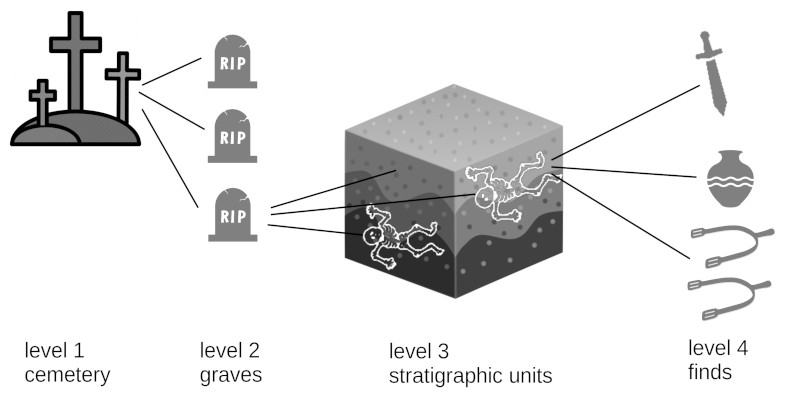

Place
=====

.. toctree::

A place can be e.g. a continent, a city or a graveyard.

.. include:: navigation.rst

Form fields
-----------
* :doc:`/form/name`
* :doc:`/form/alias`
* :doc:`/form/type`
* :doc:`/form/date`
* :doc:`/form/description`
* :doc:`/tools/map`
* **Administrative Unit**
* **Historical Place**

You can edit administrative units and historical places at **Types** in the **Places** tab.

Administrative Unit
*******************
Hierarchy of administrative units in which the place is located, e.g. Austria, Italy and their respective subunits like Lower Austria, Styria.

Historical Place
****************
Hierarchy of historical places respectively historical administrative units in which the place is located e.g. Duchy of Bavaria or Lombard Kingdom.

Can be linked via tabs to
-------------------------
* :doc:`source` - when it is referenced there
* :doc:`event` - as an event location
* :doc:`reference`
* :doc:`/tools/file`

Sub units
---------
In the OpenAtlas database a place is a physical thing that has a certain position and or extend in
space that can be connected to various other information (temporal, spatial, events, sources etc.).

To record archaeological information a place can be divided into multiple subunits. The place can be
understood as the superior unit and container for multiple further features (E.g. buildings, graves,
pits, ditches, ramparts etc.). They are labelled as "Features" and can be accessed via the features
tab. They are structured the same way as the place is and may also contain multiple subunits that
are labelled as "Stratigraphic Units". The stratigraphic units can again contain multiple subunits
labelled as finds and again are structured the same way as the superior units.

One example would be a graveyard. It will be the superior unit (Place). Each grave of this cemetery
is a (sub) feature that forms part of the cemetery. Each grave is composed of one or many subunits
(stratigraphic units). This would be the burials in the very grave (e.g. a primary and a secondary
burial) and the back filling. Each stratigraphic unit may have associated finds belonging to the
respective unit: e.g. the grave goods of one of the burials, the finds found in the back filling.

Also Human remains can be recorded in detail, especially for anthropological analyses. This way
each bone (resp. part of the human remains) can be recorded as subunits of stratigraphic units
labelled as "Human Remains".
