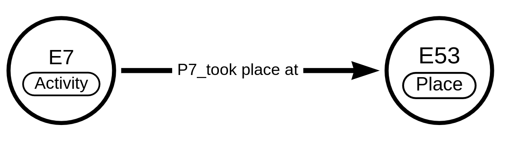

CIDOC CRM
==========

.. toctree::

The `CIDOC Conceptual reference model <https://www.cidoc-crm.org/>`_ is a
widely used ontology in the digital humanities as well as an
`ISO standard <https://www.iso.org/standard/57832.html>`_.
It is a formal ontology, developed by an developed by an interdisciplinary team
in connection with the International Council of Museums
(`ICOM <https://icom.museum/en/>`_).

It is used as basis for the underlying data model of OpenAtlas and the
currently used version is
`CIDOC CRM v7.1.1 <https://cidoc-crm.org/Version/version-7.1.1>`_ published in
May 2021.
A script is used to parse the specification and import it into a
PostgreSQL database (more information is available on
`GitHub <https://github.com/craws/OpenAtlas/tree/main/install>`_)

The ontology consists of classes, linked together by properties.

CIDOC classes
-------------
Classes are indicated by a preceding **E** followed by a numeric code-e.g. “E29
Actor” or “E67 Birth”.
All entities used within OpenAtlas can be characterised as CIDOC classes.
An overview of all CIDOC CRM classes can be found
`at <https://demo.openatlas.eu/overview/model/cidoc_class_index>`_. The count
indicates how many times each class has been used in this database instance.
A click on the class name will get you to an overview of the class with
detailed information, such as a short description, sub- and super classes as
well as possible properties.

CIDOC Properties
----------------
CIDOC entities are indicated by a combination of “P” and a numerical sequence -
think “P26 moved to” or “P52 has current owner”. They are used to link classes
to other classes. So when an activity to place at a certain location, this can
be modelled in the following way

An overview of all CIDOC CRM properties can be found
`here <https://demo.openatlas.eu/overview/model/property>`_. The count
indicates how many times each property has been used in this database instance.
A click on the property name will get you to an overview of the property with
detailed information, such as a short description.

OpenAtlas does not import nor use inverse properties (ending with i) since our
links are directed anyway. Nevertheless their labels are imported for more
convenient browsing possibilities of relations.
Properties with URLs as domain/range are ignored because the system used here
has a foreign key on domain which must match an existing class.
Also some properties are linked as sub_properties_of properties with the i
suffix. Since we don't use inverse properties in the database
(direction is determined through domain/range selection)they are linked to
their counterpart without i.

There are some "special" properties we ignore, e.g. P3, you can look them up in the OpenAtlas CIDOC parser script where they are defined at the top: https://github.com/craws/OpenAtlas/blob/main/install/crm/cidoc_rtfs_parser.py
We don't import them because of technical reasons, e.g. they are missing some definitions that "normal" properties have and the import script would have troubles to deal with them. E.g. they have no defined range but this is a foreign key in our database that can't be empty.
