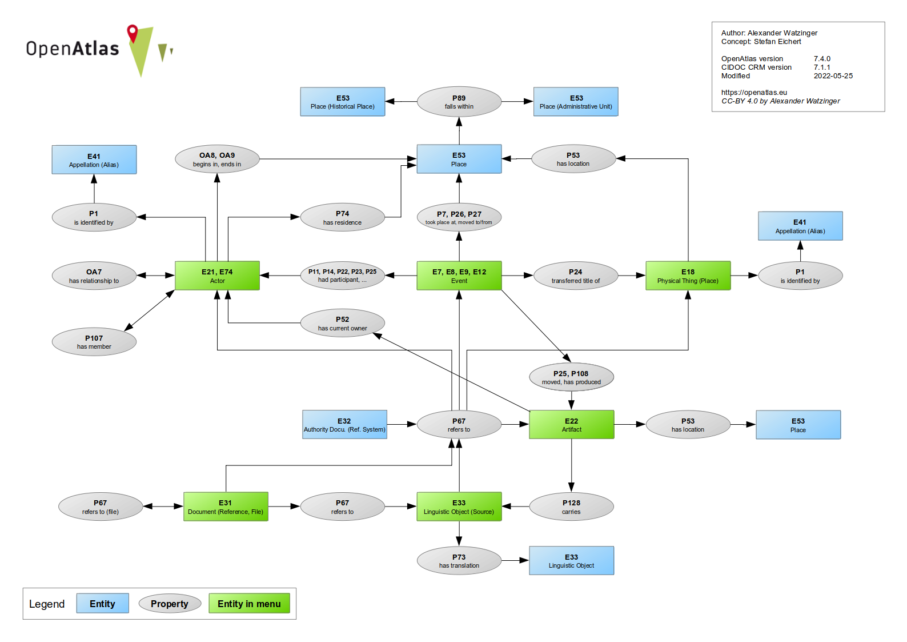
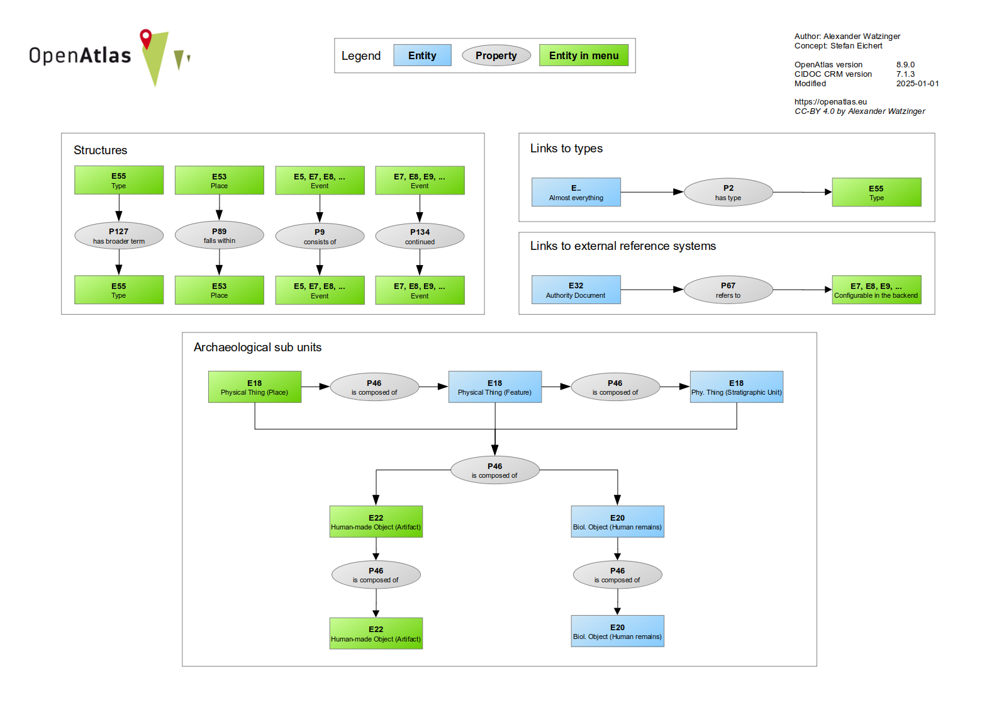

Model
=====

.. toctree::
   :maxdepth: 1

   cidoc_crm
   openatlas_classes
   openatlas_shortcuts
   references
   link_checker

**Data Model**

OpenAtlas automatically maps information to
`CIDOC CRM <https://www.cidoc-crm.org/>`_ which is used to build the model
of the database. This happens in the background of the application without
the user noticing. Therefore, the database can be used by anyone without
prior knowledge of data modeling, ontologies, CIDOC CRM
and the alike.
As the definitions of the CIDOC Conceptual Reference Model are imported into
the system, its
`classes <https://demo.openatlas.eu/overview/model/cidoc_class_index>`_
and `properties <https://demo.openatlas.eu/overview/model/property>`_ can be
browsed directly in OpenAtlas (for more information see
:doc:`here<cidoc_crm>`).
Furthermore, it is possible to verify link-conformity between entities via the
`link-checker <https://demo.openatlas.eu/overview/model>`_ (more
information is available :doc:`here<link_checker>`).

During the development of the database emphasis is put on easy usage without
prior knowledge on data models or it ontologies.

For everyone interested, a graphical representation of the current data model
can be found by clicking the **Model** button on the start page. Furthermore, a
link checker that helps you find valid CIDOC CRM links as well as links to
all classes and properties is provided :doc:`here<link_checker>`.

It is possible to show the CIDOC class of each entity in the detail view
of the user interface. To enable this, click the gear symbol and choose
:doc:`profile</tools/profile>`. Go to **Display**, press the **Edit** button
and choose **Show CIDOC classes**.

Instead of introducing own classes or using extensions, OpenAtlas uses only
basic CIDOC CRM classes and properties wherever possible. In addition, some
shortcuts are used to increase performance and to keep the code base
maintainable. For more information, see
:doc:`OpenAtlas shortcuts<openatlas_shortcuts>`.

It's also worth noting that OpenAtlas in some cases saves dates and type
IDs in links between entities, e.g. a participation of an actor at an event
(which is a link) can have associated dates and a type ID.

While OpenAtlas uses the CIDOC CRM within the application, a finer grained
model is needed to deal with contextual differences in the user interface.
Therefore, :cidoc_entity:`E33 - Linguistic Object<e33-linguistic-object>` is
used as class for sources as well as source translations with different user
interface forms.
An overview of the internal mapping and CIDOC CRM classes can be found
`here <https://github.com/craws/OpenAtlas/tree/main/install/crm>`_.
