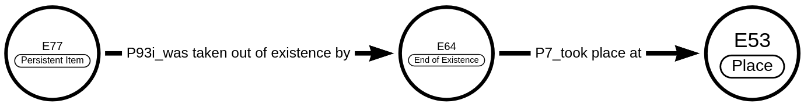
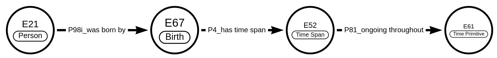
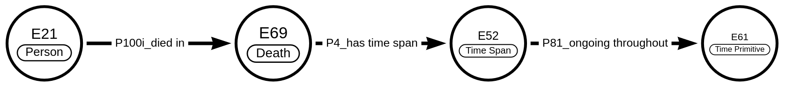
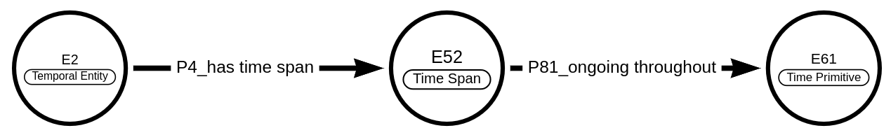

OpenAtlas shortcuts
===================

.. toctree::

OpenAtlas uses several shortcuts in order to simplify connections between
entities that are always used the same way. All shortcuts can be resolved
according to :doc:`CIDOC CRM<cidoc_crm>` specifications and are valid
links. These shortcuts are indicated by a preceding OA in combination with a
number. Currently OpenAtlas uses 3 shortcuts:

OA7 - has relationship to
-------------------------

OA7 is used to link two instances of :cidoc_entity:`E39 - Actor<e39-actor>` via
a certain relationship; in that way an actor can be linked with an actor.
:cidoc_entity:`E39 - Actor<e39-actor>` linked with
:cidoc_entity:`E39 - Actor<e39-actor>`

* Domain::cidoc_entity:`E39 - Actor<e39-actor>`
* Range: :cidoc_entity:`E39 - Actor<e39-actor>`

.. image:: oa7.png

::

   E39(Actor) - P11i(participated in) - E5(Event) - P11(had participant) - E39(Actor)

Example:
[Stefan (:cidoc_entity:`E21<e21-person>`)] participated in
(:cidoc_property:`P11i<p11-had-participant>`) [Relationship from Stefan to
Joachim (:cidoc_entity:`E5<e5-event>`)] had participant
(:cidoc_property:`P11<p11-had-participant>` [Joachim
(:cidoc_entity:`E21<e21-person>`)]

The connecting event is defined by an entity of class
:cidoc_entity:`E55<e55-type>`: [Relationship from Stefan to Joachim
(:cidoc_entity:`E5<e5-event>`)] has type
(:cidoc_property:`P2<P2-has-type>`) [Son to Father
(:cidoc_entity:`E55<e55-type>`)]

OA8 - appears for the first time in
-----------------------------------

OA8 is used to link the beginning of a Persistent Item's
(:cidoc_entity:`E77<e77-persistent-item>`) life
span (or time of usage) with a certain place. E.g to document the birthplace of
a person.

:cidoc_entity:`E77 - Persistent Item<e77-persistent-item>` linked with a
:cidoc_entity:`E53 - Place<e53-place>`.

* Domain: :cidoc_entity:`E77 - Persistent Item<e77-persistent-item>`
* Range: :cidoc_entity:`E53 - Place<e53-place>`

.. image:: oa8.png

::

   E77(Persistent Item) - P92i(was brought into existence by) - E63(Beginning of Existence) -
   P7(took place at) - E53(Place)

Example:
[Albert Einstein (:cidoc_entity:`E521<e21-person>` was brought into existence
by
(:cidoc_property:`P92<p92-brought-into-existence>`) [Birth of Albert Einstein
(:cidoc_entity:`E567<e67-birth>`)] took place at
(:cidoc_property:`P7<p7-took-place-at>`) [Ulm (:cidoc_entity:`E53<e53-place>`)]

OA9 - appears for the last time in
----------------------------------

OA9 is used to link the end of a Persistent Item's
(:cidoc_entity:`E77<e77-persistent-item>`) life
span (or time of usage) with a certain place (:cidoc_entity:`E53<e53-place>`).
E.g to document a person's place of death.
:cidoc_entity:`E77 - Persistent Item<e77-persistent-item>` linked with a
:cidoc_entity:`E53 - Place<e53-place>`.

* Domain: :cidoc_entity:`E77 - Persistent Item<e77-persistent-item>`
* Range: :cidoc_entity:`E53 - Place<e53-place>`

::

   E77(Persistent Item) - P93i(was taken out of existence by) - E64(End of Existence) -
   P7(took place at) - E53(Place)

Example:
[Albert Einstein (:cidoc_entity:`E21<e21-person>`)] was taken out of existence
by (:cidoc_property:`P93i<P93-took-out-of-existence>`)
[Death of Albert Einstein (:cidoc_entity:`E69<e69-death>`)] took place at
(:cidoc_property:`P7<p7-took-place-at>`) [Princeton
(:cidoc_entity:`E53 - Place<e53-place>`)]

Dates
-----

For dates, data is stored in the table model.entity respectively model.link in
the fields begin_from, begin_to, begin_comment, end_from, end_to, end_comment
as timestamps.
Depending on class of the entity respectively the domain and range classes of
the link, these dates can be mapped as CIDOC CRM
:cidoc_entity:`E61 - Time Primitive<e61-time-primitive>` entities.

E77 - Persistent Item
+++++++++++++++++++++

E77 Persistent Item **begin** linked with a E61 Time Primitive:

* Domain: :cidoc_entity:`E77 - Persistent Item<e77-persistent-item>`
* Range: :cidoc_entity:`E61 - Time Primitive<e61-time-primitive>`

.. image:: e77_begin.png

::

   E77(Persistent Item) - P92i(was brought into existence by) - E63(Beginning of Existence) -
   P4(has time span) - E52(Time Span) - P81(ongoing throughout) - E61(Time Primitive)

Example: [Holy Lance (:cidoc_entity:`E22<e22-human-made-object>`)] was
brought into existence by :cidoc_property:`P92i<p92-brought-into-existence>`
[forging of Holy Lance
(:cidoc_entity:`E12<e12-production>`)] has time span
(:cidoc_property:`P4<P4-has-time-span>`) [Moment/Duration of Forging of Holy
Lance (:cidoc_entity:`E52<e52-Time-Span>`)] ongoing throughout
(:cidoc_property:`P81<p81-ongoing-throughout>`) [0770-12-24
(:cidoc_entity:`E61<e61-Time-Primitive>`)]

E77 Persistent Item **end** linked with a E61 Time Primitive:

* Domain: :cidoc_entity:`E77 - Persistent Item<e77-persistent-item>`
* Range: :cidoc_entity:`E61 - Time Primitive<e61-time-primitive>`

.. image:: e77_end.png

::

   E77(Persistent Item) - P93i(was taken out of existence by) - E64(End of Existence) -
   P4(has time span) - E52(Time Span) - P81(ongoing throughout) - E61(Time Primitive)

Example: [The one ring
(:cidoc_entity:`E22<e22-human-made-object>`)] was destroyed by
(:cidoc_property:`P13<p13-destroyed>`) [Destruction of the one ring
(:cidoc_entity:`E6<e6-destruction>`)] has time span
(:cidoc_property:`P4<P4-has-time-span>`) [Moment of throwing it into the lava
(:cidoc_entity:`E52<e52-Time-Span>`)] ongoing throughout
(:cidoc_property:`P81<p81-ongoing-throughout>`) [3019-03-25
(:cidoc_entity:`E61<e61-Time-Primitive>`)]

E21 Person
++++++++++

E21 Person's **Birth** linked with a E61 Time Primitive:

* Domain: :cidoc_entity:`E21 - Person<e21-person>`
* Range: :cidoc_entity:`E61 - Time Primitive<e61-time-primitive>`

::

   E21(Person) - P98i(was born) by - E67(Birth) - P4(has time span) - E52(Time Span) -
   P81(ongoing throughout) - E61(Time Primitive)

Example: [Stefan(:cidoc_entity:`E21<e21-person>`)] was born
(:cidoc_property:`P98i<p98-brought-into-life>`) [birth of Stefan
(:cidoc_entity:`E67<e67-birth>`)] has time span
(:cidoc_property:`P4<p4-has-time-span>`) [Moment/Duration of Stefan's birth
(:cidoc_entity:`E52<e52-time-span>`)] ongoing throughout
(:cidoc_property:`P81<p81-ongoing-throughout>`) [1981-11-23
(:cidoc_entity:`E61<e61-time-primitive>`)]

E21 Person's **Death** linked with a E61 Time Primitive:

* Domain: :cidoc_entity:`E21 - Person<e21-person>`
* Range: :cidoc_entity:`E61 - Time Primitive<e61-time-primitive>`

::

   E21(Person) - P100i(died in) - E69(Death) - P4(has time span) - E52(Time Span) -
   P81(ongoing throughout) - E61(Time Primitive)

Example: [Lady Diana
(:cidoc_entity:`E21<e21-person>`)] died in
(:cidoc_property:`P100i<p100-was-death-of>`) [death of Diana
(:cidoc_entity:`E69<e69-death>`)] has time span
(:cidoc_property:`P4<p4-has-time-span>`) [Moment/Duration of Diana's death
(:cidoc_entity:`E52<e52-time-span>`)] ongoing throughout
(:cidoc_property:`P81<p81-ongoing-throughout>`) [1997-08-31
(:cidoc_entity:`E61<e61-time-primitive>`)]

E2 Temporal Entity
++++++++++++++++++

E2 Temporal Entity (also property) **begin** linked with a E61 Time Primitive:

* Domain: :cidoc_entity:`E2 - Temporal Entity<e2-temporal-entity>`
* Range: :cidoc_entity:`E61 - Time Primitive<e61-time-primitive>`

::

   E2(Temporal Entity) - P4(has time span) - E52(Time Span) - P81(ongoing throughout) -
   E61(Time Primitive)

Example: [Thirty Years' War
(:cidoc_entity:`E7<e7-activity>`)] has time span
:cidoc_property:`P4<p4-has-time-span>` [Moment/Duration of Beginning of Thirty
Years' War (:cidoc_entity:`E61<e61-time-primitive>`)] ongoing throughout
(:cidoc_property:`P81<p81-ongoing-throughout>`) [1618-05-23
(`E61<e61-time-primitive>`)]

E2 temporal entity (also property) **end** linked with a E61 Time Primitive:

* Domain: :cidoc_entity:`E2 - Temporal Entity<e2-temporal-entity>`
* Range: `E61 - Time Primitive<e61-time-primitive>`

::

   E2(temporal entity) - P4(has time span) - E52(Time Span) - P81(ongoing throughout) -
   E61(Time Primitive)

Example: [Thirty Years' War
(:cidoc_entity:`E7<e7-activity>`)] has time span
(:cidoc_property:`P4<p4-has-time-span>`) [Moment/Duration of End of Thirty
Years' War (:cidoc_entity:`E52<e52-time-span>`)] ongoing throughout
(:cidoc_property:`P81<p81-ongoing-throughout>`) [1648-10-24
(:cidoc_property:`E61<e61-time-primitive>`)]

Radiocarbon dating type
+++++++++++++++++++++++

To track :doc:`radiocarbon dating </tools/radiocarbon_dating>`, OpenAtlas links
a stratigraphic unit (E18) to a type (E55) based on CIDOC CRM classes and
properties:

Domain: Stratigraphic Unit as
:cidoc_entity:`E18 - Physical thing <e18-physical-thing>`
Range: :cidoc_entity:`E55 - Type<e55-type>`

::

   E18 (Stratigraphic Unit) - P2 (has type) - E55 (Type)

This specific type is named **radiocarbon dating** and is only used for this
purpose.
At the same time, the property (:cidoc_property:`P2<p2-has-type>`) has a
description linked to it via:

::

   P2 (has type) - P3 (has note) - E62 (String)
   P2 (has type) - P43 (has dimension) - E54 (Dimension)

