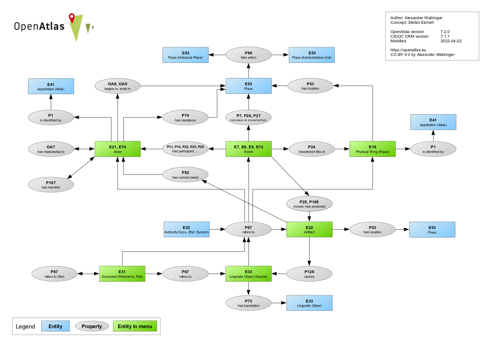

Model
=====

.. toctree::

The software automatically maps information to the international standard of the
`CIDOC CRM <http://www.cidoc-crm.org/>`_. The CIDOC CRM was imported to the system, can be
browsed and is used to verify link conformity between entities.

Although it was paid much attention to design a web interface where users don't have to be aware of
the underlying data model, interested user can get insights how their data is mapped.

On the start page (after logged) is a **Model** button which leads to a graphical presentation of
the model (see below), a link checker and links to browse the classes and properties.

You can also active the **advanced Layout** in your :doc:`/tools/profile` which displays the CIDOC
CRM class of an entity at the detail view.

Classes
-------
All entities belong to a CIDOC CRM class. E.g. a person has the class **Person (E21)**. In the
overview table you can browse the classes and see how often they were used. A click on the
class name will get you to a detail view with more information, e.g. a description and their super
and sub classes.

Properties
----------
Entities are linked with a CIDOC CRM property. E.g. if you select a location for an activity,
the **Activity (E7)** will be linked with the property **took place at (P7)** to a **Place (E53)**.

Link Checker
------------
At the model overview there is also a link checker which can be used to test if certain
class and properties connections are CIDOC CRM conform.
