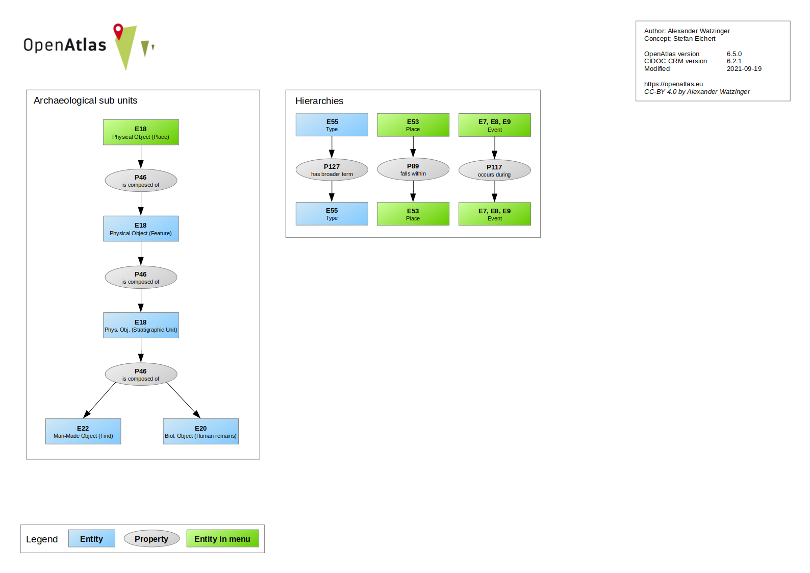

Model
=====

.. toctree::

The software automatically maps information to the international standard of the
`CIDOC CRM <https://www.cidoc-crm.org/>`_. The CIDOC CRM was imported to the
system, can be browsed and is used to verify link conformity between entities.

Although it was paid much attention to design a web interface where users don't
have to be aware of the underlying data model, interested user can get insights
how their data is mapped.

After login there is a **Model** button on the start page which leads to a
graphical presentation of the model (see below), a link checker and links to
browse the classes and properties.

.. image:: openatlas_schema.png

You can also active the **advanced Layout** in your :doc:`/tools/profile` which
displays the CIDOC class of an entity at the detail view.

CIDOC Classes
-------------
All entities belong to a CIDOC class. E.g. a person has the class
**Person (E21)**. In the overview table you can browse the classes and see how
often they were used. A click on the class name will get you to a detail view
with more information, e.g. a description and their super and sub classes.

CIDOC Properties
----------------
Entities are linked with a CIDOC property. E.g. if you select a location
for an activity, the **Activity (E7)** will be linked with the property
**took place at (P7)** to a **Place (E53)**.

OpenAtlas Classes
-----------------
OpenAtlas uses the CIDOC in the application but because of contextual
differences we needed a more fine grained model for the user interface.
E.g. E33 Linguistic Object can be a source or a source translation which have
different forms in different context.

Following the **OpenAtlas Classes** link you will see an overview of classes
used in OpenAtlas with details such as corresponding CIDOC class, used
standard type, user access and more.

Link Checker
------------
With the link checker you can test if certain class and property connections
are CIDOC CRM conform.
