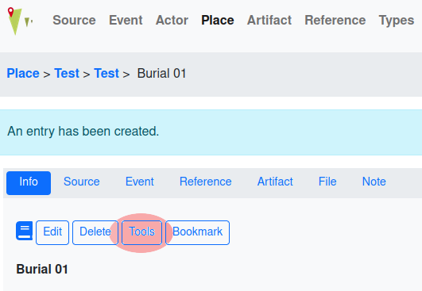
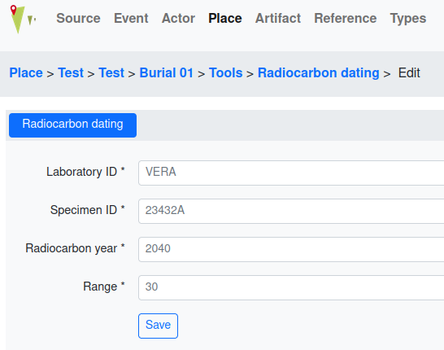

Radiocarbon Dating
==================

.. toctree::

This tool is ment to track results of radiocarbon dating. As the tools for
:doc:`anthropological_analyses` it can be accessed by pressing the **Tools**
button displayed on the level of stratigraphic units.

After then pressing the **Radiocarbon dating** button, you can add and/or edit
the following information:

* **Laboratory ID** - an alphanumerical abbreviation of thge lab that conducted
  the analyses, e.g. VERA for Vienna Environmental Research Accelerator
* **Specimen ID** - a numeric ID given to the sample by the conducting
  laboratory
* **Radiocarbon year** - Result if the analysis in years, e.g. 1015
* **Range** - Accounts for the possible error of the measurement and is stated
  in the result as +/- value in years, e.g. +/- 30. In the form you only state
  the amount of years, adding +/- into the form field is not necessary

An overview over the added/edited information is provided after saving the
data.

